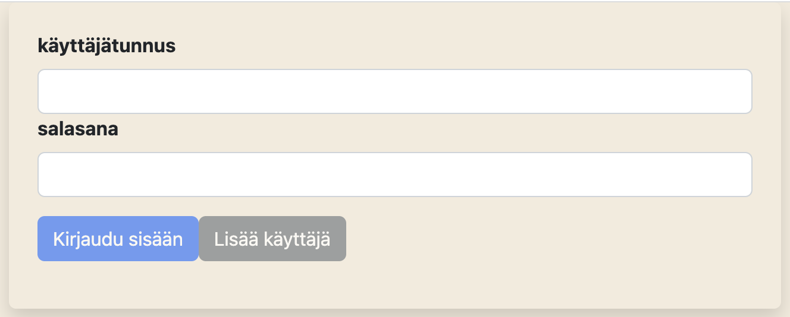
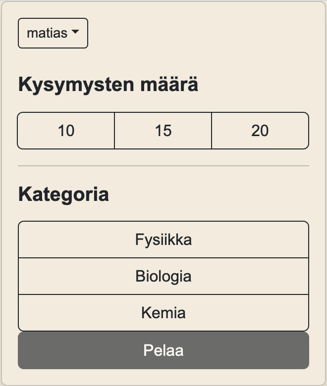
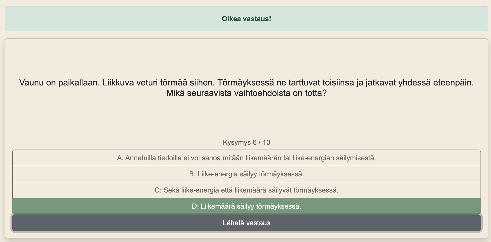
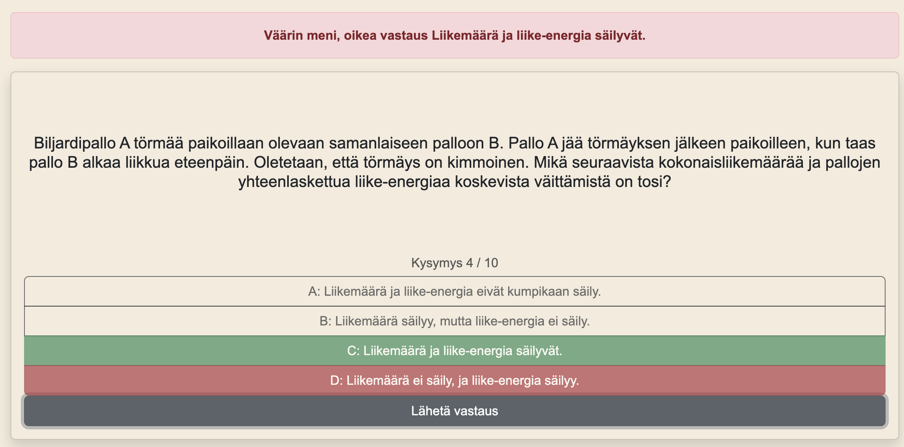
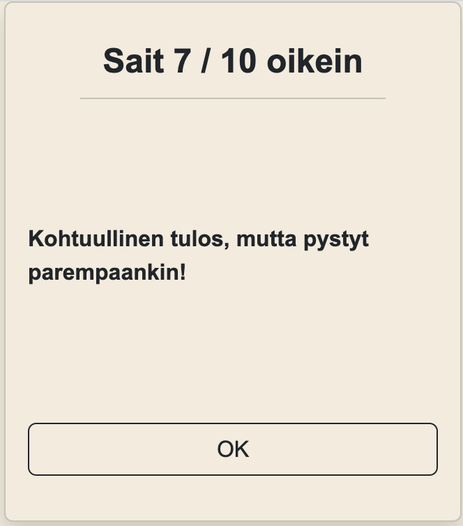
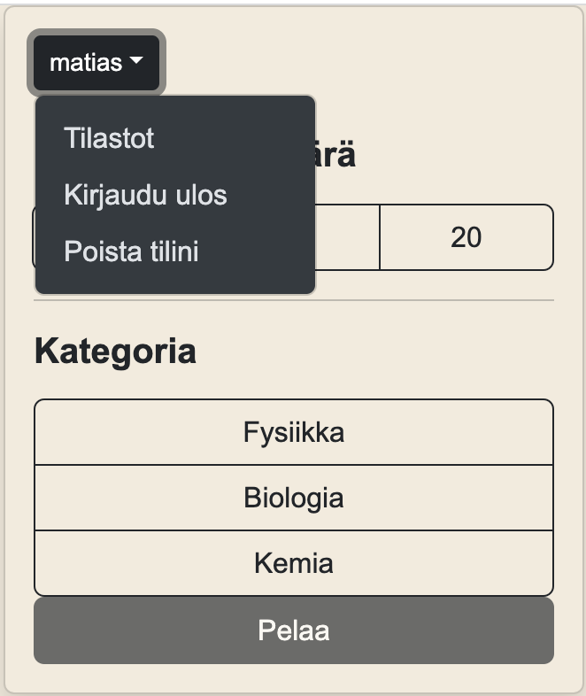
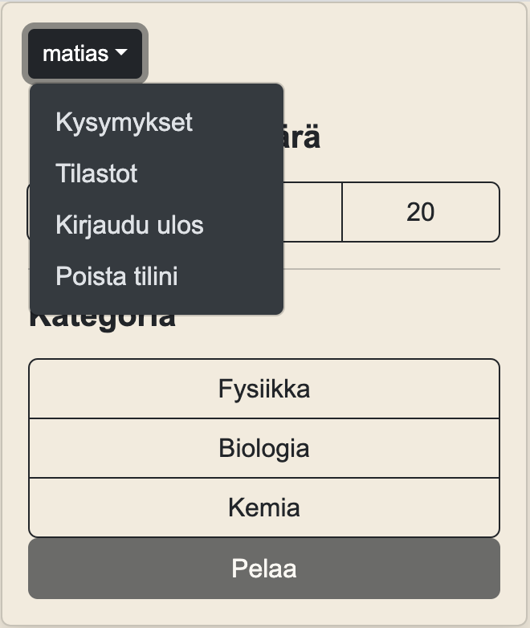
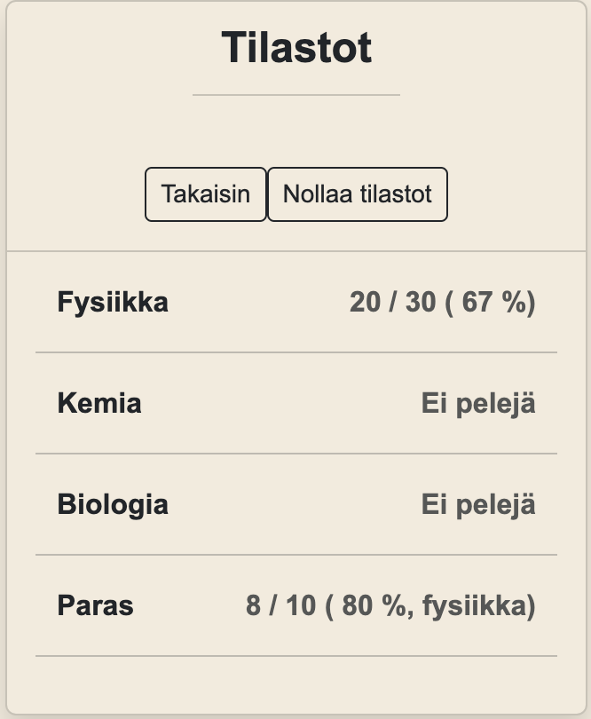
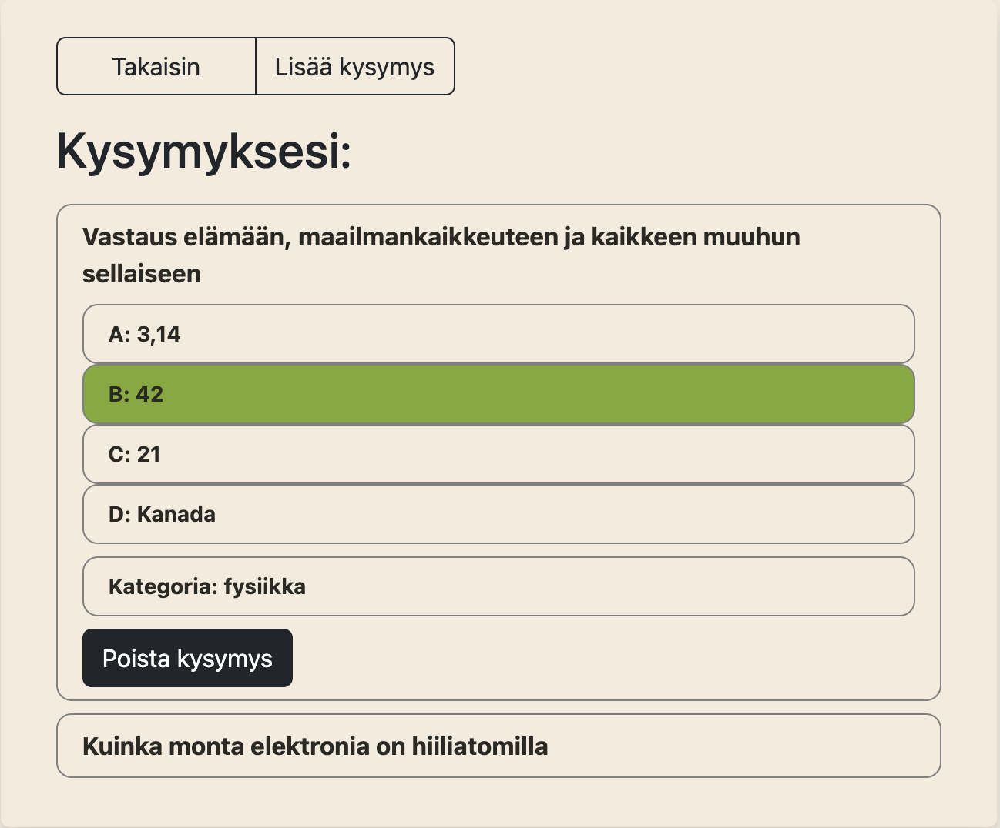
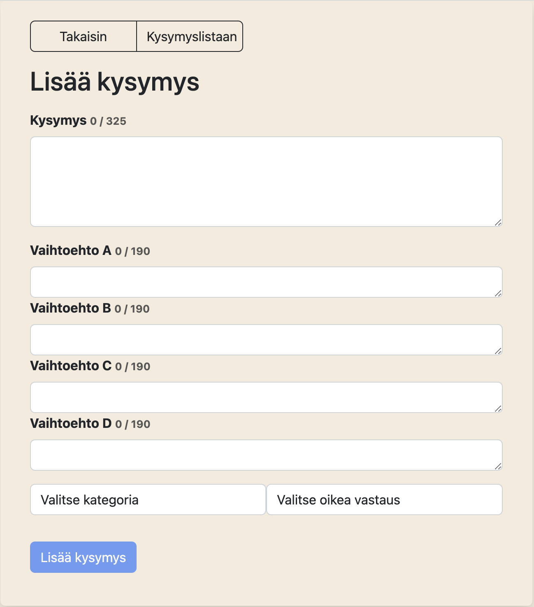

## Käyttöohjeet

### 1. Kirjaudu sisään tai luo käyttäjä

### 2. Valitse kysymysten määrä ja kategoria

### 3. Vastaile kysymyksiin. Sovellus kertoo, oliko vastauksesi oikein vai väärin

### 4. Kun olet vastannut kaikkiin kysymyksiin, näet tuloksesi ja saat palautteen

### 5. Klikkaamalla käyttäjänimeäsi etusivulla sinulle aukeaa valikko

Valikon sisältö riippuu siitä oletko admin vai et. Jos et ole, voit pyytää admin-oikeuksia valikosta (ohjelman tässä versiossa oikeudet myönnetään automaattisesti). Muussa tapauksessa valikossa on linkki sivulle, jossa voit lisätä kysymyksiä ja poistaa itse lisäämiäsi kysymyksiä. Kaikki käyttäjät näkevät tilastosivulle vievän linkin sekä mahdollisuuden kirjautua ulos tai poistaa käyttäjätilinsä.

### 6. Tilastosivulla näet yhteenvedon tilastoistasi kategorioittain sekä parhaan suorituksesi

### 7. Kysymyssivulla näet itse lisäämäsi kysymykset ja voit lisätä uusia kysymyksiä. Oikeanpuoleinen nappi vaihtele näiden näkymien välillä.

Kysymyslistasta kysymystä klikkaamalla aukeaa kysymyksen vastausvaihtoehdot sekä kategoria ja mahdollisuus poistaa kysymys. Oikea vastaus on korostettu vihreällä.

