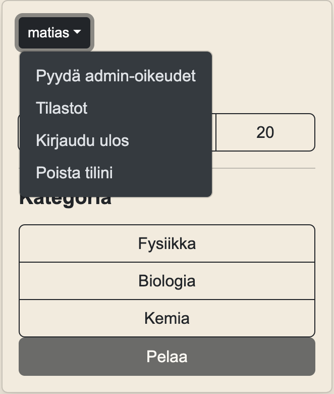

## Käyttöohjeet

### 1. Kirjaudu sisään tai luo käyttäjä

### 2. Valitse kysymysten määrä ja kategoria

### 3. Vastaile ksymyksiin. Sovellus kertoo, oliko vastauksesi oikein vai väärin

### 4. Kun olet vastannut kaikkiin kysymyksiin, näet tuloksesi ja saat palautteen

### 5. Klikkaamalla käyttäjänimeäsi etusivulla pääset tarkastelemaan tilastojasi. Voit myös kirjautua ulos tai poistaa käyttäjäsi

